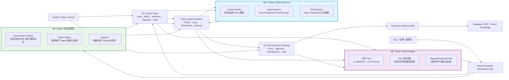
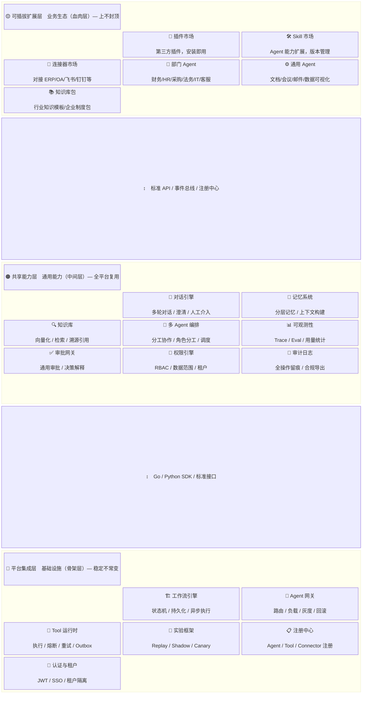

# Architecture

> 文档状态：Active Specification
> 更新日期：2026-08-18
> 实现进度：M1-M6 已完成（Durable Run / Tool Gateway / Connector / Context·Skill·Memory / Trace·Eval / Workbench）；M7 对话式骨架为当前里程碑。
> 三层架构总纲（M7-M9）见本文「三层架构」章节与 [AGENTIC_WORKBENCH_M7_M9_DESIGN.md](../05_FUTURE/AGENTIC_WORKBENCH_M7_M9_DESIGN.md)。

## 总体架构



当前已实现的主链仍是：

```text
React
→ Go Workflow + Asynq Worker
→ Go Agent Gateway
→ Python FastAPI + Finance LangGraph
→ Go 持久化节点结果、审批、归档和审计
```

目标架构在此基础上增加 Durable Run、Tool Gateway、Connector、Trace/Eval 与 M7 对话式骨架，不通过重写现有 Finance 主链获得。

## 三层架构（M7-M9 分层总纲）

产品评审（2026-08-18）确定路线 C：**平台做骨架，工作台做血肉**——每轮迭代同时交付一层平台能力、一层用户体验、一层业务场景。



**分层判定标准**：骨架层不因新增业务而改动；共享层被多 Agent 复用且可替换升级；扩展层安装即用、卸载无残留。

### 现有模块的层归属

| 层 | 模块 | 现状 |
|---|---|---|
| 平台集成层（骨架） | 工作流引擎 / Agent 网关 / Tool 运行时 / 实验框架 / 注册中心 / 认证与租户 | ✅ M1-M6 已建成 |
| 共享能力层（肌肉） | 对话引擎 | 🎯 M7-A（[ADR-007](ADR-007_CONVERSATION_ENGINE_SSE.md)） |
| | 记忆系统 | M4 已有 CRUD；"记忆管理中心"产品化后续补齐 |
| | 知识库 | 🎯 M7-D pgvector 迁移（[ADR-008](ADR-008_PGVECTOR_MIGRATION.md)）；M8-D 产品化 |
| | 多 Agent 编排 / LLM Gateway | 🎯 M9 |
| | 可观测性 / 审批网关 / 权限引擎 / 审计 | ✅ M5/M6 已有技术底座，产品化指标 M9-D |
| 可插拔扩展层（血肉） | Agent 画廊 / 部门 Agent / 通用 Agent | 🎯 M7-B/C（[AGENT_GALLERY.md](../03_PLATFORM_SPEC/AGENT_GALLERY.md)） |
| | Skill 市场 / Connector 市场 / 插件 / 知识库包 | 🎯 M8 |

## 架构原则

1. Go 是企业身份、Workflow、Approval、业务状态、Policy 和 Audit 的 System of Record。
2. Python 是 Agent Runtime，负责 Graph、模型调用、Context 和 Checkpoint；不能独立改变企业业务最终状态。
3. Workflow Template 通过 `graph_key` 显式路由 Graph；LLM 不自主选择业务域。
4. Workflow 管企业业务流程，Agent Run 管智能体内部执行，两套状态机分离但可追踪关联。
5. Graph 按流程隔离，Agent 按能力复用，Tool 按权限隔离，Domain Policy 约束组合关系。
6. Tool Registry 只描述能力；所有企业系统调用经过 Tool Execution Gateway。
7. Connector 隔离供应商协议、认证和 Schema 差异；Runtime 核心不依赖 SAP、ServiceNow 或具体数据库。
8. 外部内容是不可信数据，不能覆盖系统指令或 Policy。
9. 所有关键状态和副作用都可审计、可验证、可恢复、可评估。

## 服务职责

### React Workbench

- 登录、业务入口和授权能力发现。
- Workflow/Run 时间线、节点、Step、Checkpoint 和等待原因。
- 人工审批时展示原始资料、Agent 依据、风险和不可变执行 Payload。
- Trace、Tool Call、外部请求、错误、恢复、成本和 Eval 结果。
- 不直接调用 Python Runtime 或企业 Connector。

### Go Control Plane

- Auth、User、Department、Role、Permission、Tenant。
- Business App、Workflow Template、Instance、Node Instance。
- Thread/Run 企业索引及其与 Workflow 的关联。
- Agent/Skill/Tool/Connector/Policy 配置版本治理。
- Agent Runtime Gateway、Tool Execution Gateway。
- Approval、Audit、File、CredentialRef、Trace Index、Eval Result。
- Redis/Asynq 作业、lease、heartbeat、retry、DLQ 和恢复协调。

Go 核心必须保持业务领域中立，不包含 Finance/Procurement 专用条件分支。

### Python Agent Runtime

- 根据可信的 `graph_key` 加载明确版本的 Graph。
- 执行 Agent Loop、模型调用、结构化输出和局部任务规划。
- **M4**: 调用 Context Builder 获取组装后的上下文（System Prompt + Memory + History）。
- **M4**: 绑定 Skill 版本，使用 Skill 配置的 Prompt 和 Tools。
- 持久化 Checkpoint，产生 Interrupt，接受 Resume/Cancel。
- 向 Go Tool Execution Gateway 发起结构化 Tool Call。
- 返回 Runtime Event 和结果，不直接写平台业务表。

### Context Builder (M4)

- 聚合多个来源的上下文：System Prompt、Domain/Team/User/Thread Memory、Chat History。
- 基于 ACL 过滤不可见的 Memory 条目。
- Token 预算裁剪：按优先级（System > Domain > Team > User > Thread > History）从低到高裁剪。
- 为 Agent Runtime 提供最终的 Prompt/Messages。

### Agent Memory Service (M4)

- 管理五层记忆（Run/Thread/User/Team/Domain）的 CRUD。
- 执行 ACL 访问控制：读取前校验请求者的角色/ID 是否在 ACL 白名单中。
- 跨租户隔离：强制 `tenant_id` 匹配。
- 过期清理：支持 `expires_at` 自动过期。

### Trace & Eval Service (M5)

- 记录六层 Trace 事件（L1-Workflow -> L6-Interrupt），形成完整因果链。
- 提供 Eval 评估 API：计算成本、效率、质量、稳定性等指标。
- 支持 Replay：基于历史 Trace 回放 Agent 执行。
- 支持 Shadow：将生产流量复制给新版本进行对比测试。
- 支持 Canary：按流量比例逐步发布新版本，自动回滚。

### Conversation Engine (M7 Target)

- 面向用户的对话入口：Conversation/Message 持久化、多轮上下文、澄清追问、会话历史。
- SSE 流式转发：LangGraph astream → Go SSE → 前端 EventSource；断线以 Last-Event-Id 续传。
- 画廊选择的 `agent_package` 解析为受治理的 `graph_key` 后走既有 Agent Runtime Gateway；对话入口不引入 LLM 自主跨域路由。
- 契约见 [CONVERSATION_ENGINE.md](../03_PLATFORM_SPEC/CONVERSATION_ENGINE.md)，选型见 [ADR-007](ADR-007_CONVERSATION_ENGINE_SSE.md)。

### Agent Gallery (M7 Target)

- 以 `agent_package` 为单位的 Agent 目录：通用/部门分类、能力描述、示例 Prompt、安装态。
- 画廊是发现与选择层，不是执行层；执行仍由 `graph_key` 显式路由，权限与 Domain Policy 不放宽。
- 契约见 [AGENT_GALLERY.md](../03_PLATFORM_SPEC/AGENT_GALLERY.md)。

### Knowledge Base (M7-D 迁移 / M8-D 产品化 Target)

- 文档上传 → 解析切片 → pgvector 向量化 → 检索；回答附引用溯源（"来自文档 X 第 Y 节"）。
- 租户隔离复用 PostgreSQL `tenant_id` 机制；Qdrant 退役（[ADR-008](ADR-008_PGVECTOR_MIGRATION.md)）。
- 知识内容视为不可信数据，检索结果不得覆盖系统指令或 Policy。

### LLM Gateway (M9 Target)

- Python 侧自建轻量模块：多模型路由、token 计量、预算控制、prefix cache；不引入外部 LLM 网关。


### Tool Execution Gateway

- 从可信 Run Context 获取用户、Tenant、Agent、Skill、Graph 和 Workflow 身份。
- 校验 Tool Schema、版本、Agent-Tool Binding、Domain Policy 和资源范围。
- 按风险等级执行、拒绝或创建审批。
- 管理 idempotency、timeout、retry、circuit breaker、CredentialRef 和 Audit。
- 调用 Connector 后执行 `verify`；必要时进入 `reconcile` 或 `compensate`。

### Connector Runtime

- 封装数据库、ERP、工单、知识库和文件系统协议。
- 管理认证、分页、限流、字段映射、版本和错误归一化。
- 公开 `health_check`、`execute`、`verify`，必要时公开 `compensate`。
- 不做 Agent 规划，也不自行扩大权限。

## 两类 Gateway

### Agent Runtime Gateway

方向：Go → Python。

职责：Start、Resume、Cancel、查询 Run 状态和接收 Runtime Event。

### Tool Execution Gateway

方向：Python → Go → Connector。

职责：对每次 Tool Call 授权、审批、执行、验证和审计。

两者不能混成一个“Go 调 Python 的 HTTP Client”。

## Workflow 与 Agent Run

```text
Workflow Instance
└── Workflow Node Instance: agent_graph
    └── Agent Run
        ├── Model Step
        ├── Tool Step
        ├── Checkpoint
        ├── Interrupt / Approval
        └── Final Step
```

- Workflow 可以包含文件、人工审批和系统归档等非 Agent 节点。
- 一个 Workflow Node Retry 可以创建新的 Run Attempt。
- 一个 Run 可以产生多个 Step 和 Checkpoint。
- `agent_run_logs` 是兼容摘要，不再承担完整 Runtime 状态。

## 状态权威边界

| 状态 | 权威来源 |
|---|---|
| 用户、Tenant、权限、Workflow、Approval、Audit | Go + PostgreSQL |
| Run 企业索引、配置版本、ToolCall/外部请求关联 | Go + PostgreSQL |
| Graph 内部 State、模型消息、局部游标、Checkpoint | Python Checkpointer |
| 外部工单、ERP 单据、企业数据库事实 | 对应企业系统，通过 Connector verify |
| **M4**: Agent Memory (五层记忆) | Go + PostgreSQL (agent_memory) |
| **M4**: Skill 版本与生命周期 | Go + PostgreSQL (skill_registry) |
| **M4**: Context 组装结果 | Context Builder (计算产物，可重算) |
| **M5**: Trace 事件 (六层链路) | Go + PostgreSQL (trace_events) |
| **M5**: Eval 评估结果 | Go + PostgreSQL (eval_runs) |
| **M5**: Shadow/Canary 流量切分 | Go Control Plane (动态配置) |
| **M7**: Conversation/Message 会话与消息 | Go + PostgreSQL (conversations / conversation_messages) |
| **M7**: Agent 画廊目录与安装态 | Go + PostgreSQL (agent_packages) |
| **M8**: 知识库文档与向量索引 | Go + PostgreSQL (pgvector) |
| **M9**: 模型用量与预算计量 | LLM Gateway 产账，Go 落账 (权威) |

Go 与 Python 都不得把自身缓存视为外部业务事实。恢复执行前必须根据 ToolCall 和 external request id 进行 Reconcile。

## 目标调用链 (完整含 M4/M5)

```text
User
→ Go 创建 Workflow/Run
→ Asynq 调度 Run Start
→ Python 请求 Context Builder (M4)
   → 聚合 Memory (Domain/Team/User/Thread) + System Prompt
   → ACL 过滤 + Token 预算裁剪
   → 返回组装后的 Prompt/Messages
→ Python 加载 Skill (M4) + 执行 Graph
→ 模型产生 Tool Call
→ Go Tool Gateway 授权/审批
→ Connector 调企业系统 (M3)
→ Outbox 投递 (M3-C) + verify 外部真实状态
→ Python 保存 Checkpoint 并继续
→ Go 记录 Trace Events (M5: L1-L6 六层)
→ Go 更新 Run/Workflow 摘要和 Audit
→ Eval 计算指标 (M5: 成本/效率/质量/稳定性)
→ 前端 Workbench (M6) 实时展示 Run 时间线
```

## M7 对话调用链 (Target)

```text
User
→ 前端 Agent 画廊选择 agent_package
→ Go 创建 Conversation + Message，解析 package.graph_key（可信注册数据）
→ Agent Runtime Gateway 启动 Durable Run（复用 M1 状态机与租户校验）
→ Python LangGraph astream 流式产出 → Go SSE 转发 → 前端打字机渲染
→ 信息不足时 Graph 产生 Interrupt(kind=input_required) → 澄清卡片
→ 用户回答 → Resume 继续；审批/Tool/Trace/Memory 全部复用既有链路
```

## 扩展原则

新增业务通过以下组合接入：

```text
Business App
+ Workflow Template Version
+ Explicit Graph Version
+ Agent Definition / Skill / Domain Profile
+ Tool Definition / Connector Binding
+ Domain and Runtime Policy
+ Eval Fixture
```

不得新增独立的 `procurement_runtime`、`hr_tool_gateway` 或 `legal_approval_engine`。

## 可插拔扩展原则 (M8 Target)

M8 起可插拔组件（Agent 包、Skill、Connector sidecar、知识库包）以安装/卸载语义接入注册中心：安装即用、禁用无残留、平台零代码改动。

Agent 运行形态采用混合模式：

- **官方 Agent**：Python package 动态加载（Agent Service 启动时按注册清单加载），不修改平台代码。
- **第三方/异构 Agent**：独立进程实现 Agent Protocol 并登记 runtime endpoint，Agent Runtime Gateway 按 `graph_key` 转发。

两种形态共用 `graph_key` 命名空间与治理；路由权威始终是 Go 注册中心（详见 [GRAPH_ROUTING_AND_ISOLATION.md](GRAPH_ROUTING_AND_ISOLATION.md)）。Connector 侧对应 Connector Protocol + sidecar 机制（详见 [CONNECTOR_RUNTIME.md](../03_PLATFORM_SPEC/CONNECTOR_RUNTIME.md)）。
