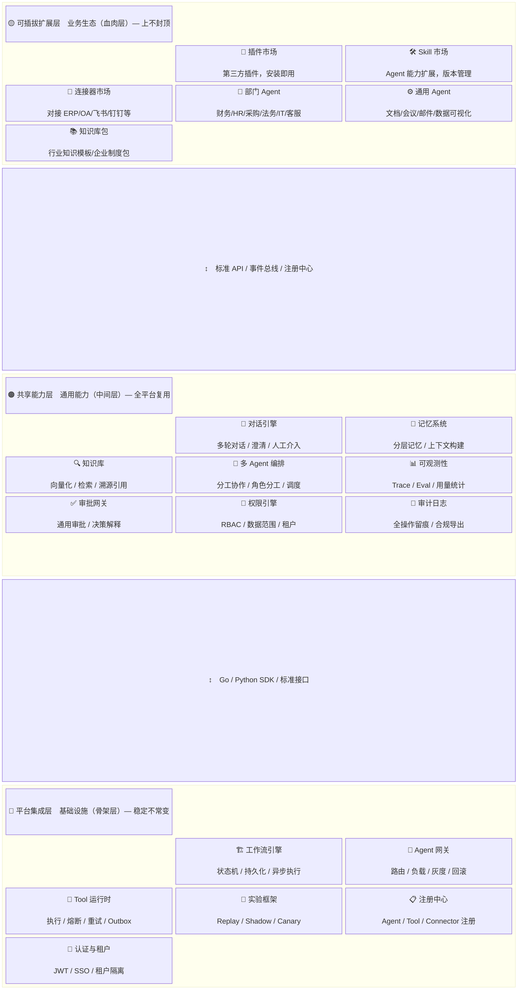

# Agentic Workbench 演进设计（M7-M9）

> 文档状态：Approved Design（2026-08-18 产品讨论定稿）
> 更新日期：2026-08-18
> 适用范围：M7/M8/M9 三轮迭代的产品形态、架构分层与技术选型
> 相关文档：[平台演进总纲](./ENTERPRISE_AGENTIC_PLATFORM_EVOLUTION.md)、[总体架构](../02_ARCHITECTURE/ARCHITECTURE.md)、[技术选型 ADR](../02_ARCHITECTURE/TECH_STACK_ADR.md)、[Workbench 设计](../06_FRONTEND/WORKBENCH_DESIGN.md)

本文是 2026-08-18 产品评审会议的结论固化，定义从"单业务工作流原型"演进为"对话式企业 Agent 工作台 + 可插拔平台"的目标形态、架构分层、技术选型与三轮迭代路线。

---

## 1. 背景与问题诊断

### 1.1 当前系统定位偏差

V1/M1-M6 交付物本质是"带一个 AI 节点的工作流引擎"，而非 Agentic Enterprise Platform。产品评审确认的核心不满：

1. **体验不是对话式**：全系统没有一个聊天框，用户仍以"填表单→走流程"的方式使用，与传统 BPM 无本质差异。
2. **业务覆盖面窄**：仅 1 个 graph（`finance_operating_report_graph`），员工/管理者/Admin 看到同一套东西，无 Agent 选择机制。

### 1.2 八项结构性缺陷（评审结论）

| # | 维度 | 缺陷 |
|---|---|---|
| 1 | Agent 层面 | 无 Agent 市场/画廊，无"通用 Agent vs 业务 Agent"分类，无个人 Agent 空间 |
| 2 | 用户视角 | 角色差异仅体现为权限校验，无产品形态差异（员工/管理者/Admin 千人一面） |
| 3 | 交互范式 | 表单驱动而非对话驱动；无澄清追问、无中途干预、无多轮改需求 |
| 4 | 知识与记忆 | Memory 仅有技术 CRUD；无知识库产品入口、无溯源引用、无记忆管理中心 |
| 5 | 业务覆盖 | 仅财务单点；HR/采购/法务/IT/客服/通用办公场景全部缺失 |
| 6 | 智能成色 | 无自主规划、无 Tool 自主选择、无反思修正、无多 Agent 协作、无主动洞察 |
| 7 | 评估可观测 | 有技术埋点无产品指标；管理者看不到效率提升与质量分布 |
| 8 | 工作台体验 | 面向开发者而非业务用户；菜单项暴露不全；技术 ID 直接暴露给业务用户 |

### 1.3 范式判断（指导原则）

> **传统系统：用户去"用"系统。Agentic System：Agent 来"帮"用户做事。**

| | 传统系统 | Agentic System |
|---|---|---|
| 交互主体 | 用户操作界面 | Agent 理解意图并执行 |
| 能力边界 | 产品设计固定 | Tool + 知识库自主扩展 |
| 协作方式 | 人推流程走 | 多 Agent 协作，人类关键节点介入 |
| 主动性 | 0 | Agent 主动发现并建议 |

---

## 2. 产品定位决策

### 2.1 两条路线的权衡

| 维度 | 企业 Agent 平台（to B） | 企业内部 Agent 工作台（to 员工） |
|---|---|---|
| 核心价值 | 可扩展性：插件/多租户/连接器市场/SDK | 场景覆盖 + 对话体验 |
| 收入模式 | 席位/用量/私有化年费 | 内部降本增效 |
| 第一屏 | Admin 控制台 | Agent 画廊 + 对话窗口 |
| MVP 标准 | 3+ 独立业务团队零改码接入 | 50% 员工周活，覆盖 3 部门 |

### 2.2 定稿结论：路线 C —— 两者并行

> **架构按"企业 Agent 平台"做（保证扩展性），产品体验按"内部 Agent 工作台"做（保证场景和对话）。**
>
> 平台做骨架，工作台做血肉——每一轮迭代同时交付"一层平台能力 + 一层用户体验 + 一层业务场景"。

理由：内部工作台必须建立在强大平台能力之上，否则每加一个部门 Agent 都要改平台代码；而平台能力若无工作台场景验证，会做成无人使用的过度设计。

---

## 3. 三层架构分层

### 3.1 分层总览

### 3.2 各层划分标准与模块归属

#### 平台集成层（骨架）—— "一次建好，长期不动"

**划分标准**：所有业务 Agent 都依赖的、技术底座性质的、不因加业务部门而改动的模块。

| 模块 | 职责 | 现状 |
|---|---|---|
| 工作流引擎 | 状态机/持久化/异步调度/节点推进 | ✅ 已有（M2） |
| Agent 网关 | 路由/负载/灰度/回滚 | ✅ 已有（M3 + M6 受控路由） |
| Tool 运行时 | 执行/熔断/重试/超时/Outbox 补偿 | ✅ 已有（M2/M3） |
| 实验框架 | Replay/Shadow/Canary | ✅ 已有（M5） |
| 注册中心 | Agent/Tool/Connector 元数据 | ✅ 已有（M3），需扩展安装/卸载语义 |
| 认证与租户 | JWT/SSO/租户隔离 | ✅ 已有（M1），SSO 后补 |

#### 共享能力层（肌肉）—— "所有 Agent 都要用，从能用到好用"

**划分标准**：多 Agent 复用的产品化能力。这是当前系统**最缺的一层**，也是对话式体验的关键支撑。

| 模块 | 现状 | 目标形态 |
|---|---|---|
| 对话引擎 | ❌ 完全缺失 | 多轮对话/澄清追问/中途改需求/暂停→人类反馈→继续/会话持久化/SSE 流式 |
| 记忆系统 | ✅ Memory CRUD（M4）❌ 无产品化 | "我的记忆中心"：Agent 记住的偏好/历史摘要/关注指标，可查看/删除/修正 |
| 知识库 | ❌ Qdrant 仅连 Python，无产品入口 | 统一知识库：文档上传→向量化→检索→回答带溯源引用 |
| 多 Agent 编排 | ❌ 单 graph | Supervisor 模式：任务分发→协作→汇总，有分工汇报关系 |
| 可观测性 | ✅ Trace/Eval 埋点（M5）❌ 无产品指标 | 管理者看板：部门节省工时/Agent 准确率/Top 失败原因/评分分布 |
| 审批网关 | ✅ ToolCall 审批 ❌ 无决策解释 | 审批界面展示 Agent 决策依据（Evidence + Reasoning + 风险点） |
| 权限引擎 | ✅ RBAC | 够用，后续丰富数据范围字段 |
| 审计日志 | ✅ 已有（M6） | 够用 |

#### 可插拔扩展层（血肉）—— "加得快、换得掉"

**划分标准**：可独立开发/安装/卸载，不影响平台其他部分，可由第三方提供。

| 模块 | 可插拔含义 | 注册机制 |
|---|---|---|
| 插件市场 | 完整功能插件（如飞书集成插件） | Manifest + 安装 Hook |
| Skill 市场 | Agent 能力包，装上多一项技能 | 扩展现有 Skill Registry（版本/审核流/UI 化） |
| 连接器市场 | 外部系统对接（ERP/钉钉/Salesforce） | Connector Protocol + sidecar 注册 |
| 部门 Agent | 财务/HR/采购/法务/IT/客服 Agent，独立安装包 | Business App → Workflow Template → Agent Graph 组合包 |
| 通用 Agent | 文档总结/会议纪要/邮件助理/数据可视化 | 同上，不绑定特定部门 |
| 知识库包 | 行业知识模板/企业制度包一键安装 | 知识空间 + 向量化导入包 |

**关键设计原则**：本层任何组件必须做到"后台页面点一下安装/启用，平台即获得该能力"——不改代码、不重新部署。

### 3.3 层间交互契约（示例场景）

员工使用"财务报销助手"的完整链路：

1. 员工在对话界面（共享层·对话引擎）输入自然语言请求
2. 对话引擎发现信息不足，追问澄清（共享层）
3. 路由到"财务报销助手 Agent"（扩展层·部门 Agent）
4. Agent 调用"ERP 连接器"查询额度（扩展层·连接器），Tool 执行保障来自平台层·Tool 运行时
5. 超额触发审批（共享层·审批网关），界面展示 Agent 决策依据与制度引用
6. 审批通过后 Agent 调用连接器创建报销单
7. 全程：平台层·工作流引擎持久化状态，共享层·记忆系统记住用户偏好，共享层·审计日志留痕

---

## 4. 技术选型定稿

### 4.1 保留不变

| 层 | 技术 | 理由 |
|---|---|---|
| 前端 | React 18 + TS + Vite + AntD 5 + Zustand | 中后台标配 |
| Go 后端 | Go 1.22 + Gin + Asynq + pgx | 强类型 + 高并发，适合地基层 |
| Agent 服务 | Python 3.12 + FastAPI + LangGraph | 生态成熟 |
| 数据/队列/存储 | PostgreSQL 16 + Redis 7 + MinIO | 强事务保障 Outbox 模式 |

### 4.2 变更决策

| 决策点 | 结论 | 理由与影响 |
|---|---|---|
| **向量库** | 迁移 **pgvector**，退役 Qdrant | 企业内部知识库通常百万向量以内；向量与业务同库，**租户隔离复用 PG 行级安全与 `tenant_id` 机制**；少维护一个组件。影响：PG 启用 pgvector 扩展；新增向量表迁移；移除 Qdrant 容器与 Python Qdrant 客户端 |
| **Agent 运行形态** | **混合模式** | 官方 Agent：Python package 动态加载（轻量快速）；第三方/异构语言 Agent：独立进程 + 注册协议，网关按 graph_key 转发。市场两类并存，安装体验统一 |
| **连接器接入** | **Connector Protocol + sidecar** | Go 无法生产级热插拔。定义 HTTP/gRPC 契约（execute/verify/compensate/health）；官方连接器编译内置，第三方以 sidecar 独立进程注册。市场安装 = 部署 sidecar + 注册元数据，平台零代码改动 |

### 4.3 新增组件

| 组件 | 方案 | 所属层 |
|---|---|---|
| **流式通道** | **SSE** 全链路：LangGraph `astream` → Go SSE 转发 → 前端 EventSource。不采用 WebSocket（单向推送够用、断线自动重连、穿透代理简单） | 共享层·对话引擎 |
| **LLM Gateway** | Python 侧**自建轻量模块**（~500 行）：多模型路由 + token 计量 + 预算控制 + prefix cache。不引入 LiteLLM（避免黑盒依赖，已有 Runtime V2 基础） | 共享层 |
| **Chat UI 组件** | 基于 AntD **自建**：消息流 + Markdown 渲染 + 引用卡片 + 工具调用进度。`@ant-design/x` 尚早期不采用。全平台 Agent 复用 | 共享层 |

### 4.4 明确不做

- ❌ 不对接 Langfuse（已有自建 L1-L6 Trace/Eval，避免数据双写；产品化指标需求明确后再评估）
- ❌ 不引入 Kafka（Redis + Asynq 够用；Agent 规模上来再评估）
- ❌ 不用 WebSocket（SSE 覆盖对话流式场景）
- ❌ 不引入 LiteLLM 等外部 LLM 网关

---

## 5. 三轮迭代路线（M7-M9）

### 5.1 M7：对话式骨架 —— 让产品"像个 Agent 产品"

| 子任务 | 内容 | 层 | 验收标准 |
|---|---|---|---|
| A. 对话引擎 v1 | SSE 流式、多轮会话持久化、澄清追问、会话历史 | 共享 | 前端打字机效果；会话刷新不丢失；Agent 可追问 |
| B. Agent 画廊 + 聊天 UI | 首页改造为 Agent 市场入口 + 聊天界面组件 | 体验 | 员工第一屏看到可选择的 Agent 卡片；分类：通用/部门 |
| C. 3 个对话式 Agent | 财务报告（对话式改造）+ 文档总结 + 会议纪要 | 业务 | 3 个 Agent 均可对话使用；输出结构化可追溯 |
| D. pgvector 迁移 | 向量表迁移 + Qdrant 退役 + 租户隔离 | 平台 | Qdrant 容器移除；检索走 PG；租户隔离测试通过 |

### 5.2 M8：可插拔机制 —— 让业务"加得快"

| 子任务 | 内容 | 层 | 验收标准 |
|---|---|---|---|
| A. Agent 包动态加载 | 官方 Agent package 规范 + 安装即用；第三方注册协议 v1 | 平台 | 新 Agent 包安装无需改平台代码/重启 |
| B. Skill 市场 v1 | 安装/卸载/版本/审核流 UI 化 | 可插拔 | Skill 全生命周期在 UI 完成 |
| C. Connector Protocol | 契约定义 + sidecar 注册接入 + 1 个示例 sidecar | 可插拔 | 第三方 sidecar 注册后可被 Tool 调用 |
| D. 知识库 v1 | 文档上传 → pgvector → 检索 → 回答带引用溯源 | 共享 | 回答附带"来自文档 X 第 Y 节"引用 |

### 5.3 M9：多 Agent 协作 + 运营化 —— 让体验"上一个台阶"

| 子任务 | 内容 | 层 | 验收标准 |
|---|---|---|---|
| A. 多 Agent 编排 | LangGraph supervisor 模式：任务分发→协作→汇总 | 共享 | 1 个跨 Agent 协作场景跑通（如财务报告 = 采集+分析+合规三 Agent） |
| B. LLM Gateway | 计量/预算/缓存 + 部门成本报表 | 共享 | 按部门/Agent 维度 token 成本可见；预算超限熔断 |
| C. 市场 UI | Agent 市场 + 连接器市场（安装/评分/用量） | 可插拔 | 市场页面完成安装→使用闭环 |
| D. 管理者看板 | 部门效率指标、Agent 质量评分、Top 失败原因 | 体验 | 管理者可回答"这个 Agent 帮部门省了多少时间" |

---

## 6. 验收与对齐原则

1. **每轮迭代三层齐备**：平台能力 + 用户体验 + 业务场景同时交付，不单腿走路。
2. **新业务零改码**：M8 后新增部门 Agent 不得修改 Go `internal/` 平台代码（业务中立原则延续）。
3. **对话优先**：M7 起新功能首先考虑对话式入口，表单流程仅作为兜底。
4. **安装即用**：可插拔层组件的启用/禁用必须在 UI 完成，禁止要求改代码或重新部署。
5. **Finance V1 回归基线**：现有财务运营报告链路保持可用，作为每轮迭代的回归主链。

---

## 7. 与现有文档的关系

- 本文替代 `05_FUTURE/ENTERPRISE_AGENTIC_PLATFORM_EVOLUTION.md` 中与产品形态相关的部分结论（该文档的 Runtime/Tool/接入技术规范仍然有效）。
- M7 各子任务实施前，需按现有流程将契约落入 `02_ARCHITECTURE/` 与 `03_PLATFORM_SPEC/` 的版本化文档。
- `01_PROJECT/ROADMAP.md` 需同步追加 M7-M9 里程碑条目。
