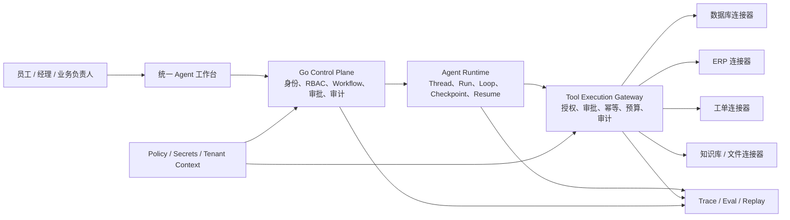

# Enterprise Agentic Platform 演进与企业系统接入规划

> 文档状态：Active North Star
> 更新日期：2026-08-16
> 适用范围：当前 Finance V1 之后的平台级迭代
> 相关文档：[总体架构](../02_ARCHITECTURE/ARCHITECTURE.md)、[Agent Protocol](../02_ARCHITECTURE/AGENT_PROTOCOL.md)、[现有 Roadmap](../01_PROJECT/ROADMAP.md)、[扩展原则](./ITERATION_AND_EXTENSION.md)

本文决定最终目标和阶段依赖；当前执行里程碑以 [`../01_PROJECT/ROADMAP.md`](../01_PROJECT/ROADMAP.md) 为准，具体实现必须先落入 `02_ARCHITECTURE/` 和 `03_PLATFORM_SPEC/` 的版本化契约。

## 1. 文档目的

本文定义项目从“具备企业治理能力的 AI Workflow Platform 原型”演进为“可持久运行、受控行动、可恢复、可评估的 Enterprise Agentic Platform”的目标架构、实施顺序和验收标准。

本文重点回答两个问题：

1. 当前项目下一阶段应该按照什么顺序迭代。
2. 平台接入企业数据库、ERP、工单、知识库等真实系统时，如何处理身份、权限、数据语义、副作用、故障恢复、安全与审计问题。

本文不替代现有 Finance V1 规范。Finance V1 继续作为兼容基线和第一条回归主链。

---

## 2. 最终目标与核心命题

项目最终需要证明以下命题：

1. 能构建新时代下真正可执行任务的企业级 Agentic System，而不只是传统 OA 页面叠加 LLM。
2. Agent 能力可以跨业务复用，但执行过程始终受身份、权限、审批、预算和审计约束。
3. Agent Runtime 具备持久状态、工具执行、Checkpoint、HITL、故障恢复、Trace 和 Eval 等完整能力。
4. 平台能够以受控方式接入企业现有数据库、ERP、工单、知识库和文件系统。
5. 新业务通过配置、版本化能力包和少量适配接入，而不是修改平台核心或增加业务 `if/else`。

最终平台的价值不在于“拥有多少个 Agent”，而在于：

> 能否让 Agent 在真实企业系统中长期、可靠、可控、可解释地完成业务目标。

---

## 3. 当前状态判断

### 3.1 已具备的基础

当前项目已经具备较完整的企业控制面骨架：

- Auth、JWT、RBAC、用户、部门和租户上下文。
- Workflow Template、Workflow Instance、Node Instance 和状态机。
- Redis + Asynq 异步执行链。
- Agent Registry、Graph Registry、Tool Registry 元数据。
- Agent Gateway 和 Agent Run Log。
- Approval Task、Audit Log、Token/Cost 基础统计。
- Go 平台控制面与 Python Agent Service 的分层。
- Finance V1 Graph、Versioned Profile、结构化输入输出和回归 Fixture。
- `graph_key` 显式路由以及业务域隔离原则。

### 3.2 关键缺口

| 能力层 | 当前形态 | 需要补齐的能力 |
|---|---|---|
| Runtime | 固定 LangGraph 执行，Go 侧保存流程结果 | Thread、Durable Run、Step、Checkpoint、Interrupt、Resume、Cancel |
| Tool | Registry 和权限元数据 | 统一 Tool Execution Gateway、调用级授权、幂等、审批、执行审计 |
| Connector | 尚未形成正式抽象 | 数据库、ERP、工单、知识库的版本化适配器契约 |
| Context | 请求上下文和 Graph State | Context Builder、来源、权限、裁剪、预算和注入防护 |
| Skill | 领域 Profile 和 Agent 代码 | 可版本化的指令、工具、资源和评估包 |
| Memory | 尚未形成平台能力 | 作用域、写入策略、检索权限、过期与删除 |
| Observability | Workflow 和 Agent Run 摘要 | Model Turn、Tool Call、Checkpoint、Interrupt 级层次化 Trace |
| Eval | Finance Fixture 和回归测试 | 任务结果、工具选择、副作用、安全和线上回归评估 |

因此，当前项目应视为：

> 具备企业治理骨架和单业务主链的 Agent Workflow Platform。

下一阶段的主要任务不是横向增加业务数量，而是纵向补齐 Runtime 和企业行动能力。

---

## 4. 目标架构



### 4.1 各层职责

#### 模型与 Agent

- 理解目标、规划步骤、选择能力并生成结构化 Tool Call。
- 不直接持有企业系统管理员凭证。
- 不直接修改平台数据库或绕过工具网关访问外部系统。
- 模型输出是候选决策，不是已经完成的业务事实。

#### Agent Runtime

- 维护 Thread、Run、Step 和 Agent Loop。
- 保存 Checkpoint，处理 Interrupt、Resume、Cancel 和 Retry。
- 控制轮次、Token、时间、成本和工具预算。
- 保证进程重启后能够恢复，并防止重复执行副作用。

#### Go Control Plane

- 作为身份、权限、企业流程状态和治理记录的权威来源。
- 管理 Workflow、Approval、Policy、Audit 和配置版本。
- 决定哪个用户、Agent、Skill 能在什么范围内执行什么动作。

#### Tool Execution Gateway

- 对 Tool Call 做 Schema 校验、策略判断、风险分级和调用级授权。
- 在高风险动作前触发 HITL。
- 管理幂等、超时、重试、熔断、凭证引用和执行审计。
- 调用完成后验证外部系统真实状态，而不是相信模型自行声明成功。

#### Connector

- 屏蔽不同企业数据库、ERP、工单和知识系统的协议差异。
- 负责认证、字段映射、版本适配、分页、限流、错误归一化和健康检查。
- 对写操作提供结果验证；必要时提供补偿或对账能力。

#### Trace 与 Eval

- 记录 Workflow、Run、Model Turn、Tool Call、Checkpoint、Interrupt 和外部请求之间的关系。
- 从任务结果、过程可靠性、权限合规、成本和用户反馈多个维度评估 Agent。

---

## 5. 平台核心对象

在继续增加业务 Agent 前，应稳定以下业务无关的对象及其版本契约：

| 对象 | 职责 |
|---|---|
| `AgentDefinitionVersion` | Agent 的目标、模型策略、输入输出契约和可用 Skill |
| `SkillVersion` | 可版本化的指令、工具集合、资源、约束和 Eval Fixture |
| `ToolDefinitionVersion` | Tool 的 Schema、风险等级、权限和执行策略 |
| `Connector` | 外部系统连接配置、能力、认证方式、版本和健康状态 |
| `CredentialRef` | 指向密钥系统中的凭证，不保存明文凭证 |
| `Thread` | 一段连续任务或会话的长期容器 |
| `Run` | Agent 为完成一次目标而进行的执行实例 |
| `Step` | 模型调用、工具调用、审批、恢复等最小可观测步骤 |
| `ToolCall` | 一次经过授权并可审计的工具调用 |
| `Checkpoint` | 可恢复的 Runtime 状态快照 |
| `Interrupt` | 等待人工、补充资料或外部事件的暂停点 |
| `EvalRun` | 对 Run 的结果、过程、安全和成本进行的评估 |

这些对象必须是平台级抽象，不得包含 Finance、Procurement 等业务专用判断。

---

## 6. 迭代顺序

正确依赖顺序是：

```text
Finance V1 契约基线
→ Durable Agent Run
→ Tool Execution Gateway
→ Connector Runtime
→ Context / Skill / Memory
→ Trace / Eval / Replay
→ 企业工作台与受控路由
→ 更多业务应用
```

### Phase A：冻结契约与回归基线

目标：确保后续 Runtime 重构不破坏现有 Finance V1。

任务：

- 保留 Finance V1 Graph 节点顺序、状态键、输出键和 Agent Run Envelope。
- 扩充契约 Fixture，覆盖成功、资料不足、可重试错误、不可重试错误和审批归档。
- 固定 Agent、Graph、Profile、Tool 的版本字段和兼容规则。
- 为后续迁移建立旧 Run Log 到新 Run/Step 模型的映射方案。
- 明确 Go 状态与 Python Checkpoint 的权威边界。

验收标准：

- Finance V1 全量回归通过。
- 后续新增字段采用向后兼容方式，不要求前端立即重写。
- 不访问真实 LLM 或企业网络即可运行核心回归测试。

### Phase B：Durable Agent Run

目标：将一次性 Graph 调用升级为可持久化、可恢复的 Agent 执行。

任务：

- 实现 `Thread`、`Run`、`Step`、`Checkpoint`、`Interrupt` 数据模型。
- Run 状态至少包括：

```text
queued
→ running
→ waiting_human / waiting_external
→ running
→ succeeded / failed / cancelled
```

- Python Runtime 接入持久化 Checkpointer。
- 实现 Resume、Cancel、Retry、超时和最大轮次/成本预算。
- Worker 增加 lease、heartbeat、attempt 和失联接管语义。
- Run 绑定 Agent、Graph、Skill、Tool 和模型配置的具体版本。
- 区分“可重试计算步骤”和“存在副作用的工具步骤”。

验收实验：

1. Agent 执行中终止 Python 进程，重启后从正确 Checkpoint 恢复。
2. Agent 执行中终止 Go Worker，不产生重复完成或重复外部写入。
3. 重复发送 Resume、Retry 或队列消息时，最终状态保持一致。
4. 等待审批期间重启所有服务，审批后仍能继续执行。

### Phase C：Tool Execution Gateway

目标：所有对企业世界产生影响的动作都通过统一网关执行。

标准调用链：

```text
模型提出 Tool Call
→ Input Schema 校验
→ 用户 / 租户 / Agent / Skill 权限校验
→ 风险等级与 Domain Policy 判断
→ 必要时创建人工审批
→ 幂等校验
→ 获取短期凭证
→ 调用 Connector
→ 验证外部系统真实结果
→ 写入 Trace、Audit 和 Usage
```

任务：

- 定义统一的 Tool Request、Tool Result 和 Tool Error Envelope。
- 将工具划分为只读、低风险写入、高风险写入和禁止调用。
- 权限判断精确到一次调用，而不是只判断 Agent 是否拥有 Tool 名称。
- 审批绑定不可变的具体 Payload、版本和有效期。
- 实现 idempotency key、timeout、retry policy、circuit breaker 和 DLQ。
- Credential 只保存引用，执行时从 Vault/KMS 获取短期凭证。
- 日志、Prompt、Checkpoint 和错误响应不得保存明文 Secret。
- Tool 执行后调用 `verify`，确认企业系统真实状态。

验收标准：

- 模型不能绕过网关访问企业系统。
- 未授权调用、跨租户调用和参数越界调用被确定性拒绝。
- 重复调用不会创建两条相同业务记录。
- 审批后的实际执行参数与被审批 Payload 完全一致。
- 每次执行能够回答“谁、何时、基于什么版本、调用了什么、结果如何”。

### Phase D：Connector Runtime

目标：通过稳定契约接入不同企业系统，不让 Agent 和 Workflow 依赖供应商细节。

统一 Connector 能力至少包括：

```text
Connector
├── manifest
├── capability
├── input_schema / output_schema
├── credential_ref
├── health_check
├── execute
├── verify
└── compensate（可选）
```

首批连接器：

1. `enterprise_db_read`：面向经过治理的只读数据视图。
2. `ticket_create_or_update`：支持幂等、并发控制和人工审批。
3. `erp_purchase_request`：先支持 Sandbox 和 Dry-run，再开放审批后写入。

验收标准：

- 替换数据库、ERP 或工单供应商时，不修改 Runtime 核心。
- Connector 能报告版本、能力、认证方式和健康状态。
- 外部 API 字段变化能够被契约测试发现。
- 外部请求与本地 Run、Step、ToolCall、Audit 可以相互追踪。

### Phase E：Context、Skill 与 Memory

目标：让 Agent 获得可治理的能力与长期上下文，而不是将三者都简化成一个向量库。

#### Context

- 定义每轮模型实际看到什么。
- 记录来源、权限、时间戳、裁剪和 Token 预算。
- 将检索内容和外部系统返回值视为不可信数据，而不是系统指令。
- 执行前重新检查敏感数据权限。

#### Skill

- Skill 是可版本化的指令、工具、资源、约束和 Eval Fixture 组合。
- Skill 发布需经过 Draft、Review、Published、Deprecated 生命周期。
- Run 必须记录使用的 Skill 版本，保证重放和审计。
- Skill 不得授予超出用户和 Agent 权限交集的能力。

#### Memory

- 区分 Run State、Thread Memory、User Memory、Team/Domain Memory。
- 定义写入条件、读取权限、来源可信度、过期时间和删除机制。
- 敏感数据默认不进入长期 Memory。
- Memory 检索必须传播租户、部门、用户和资源 ACL。

验收标准：

- 能解释每条上下文和记忆来自哪里、谁可以看到、何时失效。
- Skill 升级后旧 Run 仍能定位原版本。
- 跨用户和跨租户 Memory 隔离测试通过。

### Phase F：Trace、Eval、Replay 与企业工作台

目标：让平台能够解释、复现、评估并持续改进一次 Agent 执行。

Trace 层次：

```text
Workflow
└── Agent Run
    ├── Model Turn
    ├── Tool Call
    ├── Checkpoint
    ├── Human Interrupt
    ├── Resume
    └── Final Outcome
```

Eval 至少覆盖：

- 是否选择正确 Tool。
- Tool 参数是否正确、完整且未越权。
- 是否发生无效循环或预算超限。
- 是否出现重复写入或部分成功。
- 审批后是否执行了原始 Payload。
- 企业系统是否真正产生预期状态。
- 最终业务目标是否完成。
- 用户是否接受结果，以及人工修改了什么。

工作台提供：

- 用户目标入口和授权范围内的能力发现。
- Run 时间线、当前状态和等待原因。
- 审批时的原始资料、Agent 依据、风险和确定 Payload。
- Tool Call、外部请求、错误和恢复记录。
- 管理员的版本、策略、Connector、成本和 Eval 页面。

平台可以提供统一入口和受控 Router，但 Router 只能在用户被授权的 Business App、Agent、Skill 和 Tool 范围内选择，不能成为拥有全部权限的“万能主 Agent”。

---

## 7. 企业系统接入原则

### 7.1 身份与权限

主要风险：

- 所有 Agent 共用一个管理员账号，导致用户权限失效。
- 平台只验证登录，却没有把权限传播到数据库和外部系统。
- 后台任务混淆用户身份与服务身份。
- Token 被记录在日志、Prompt、Trace 或 Checkpoint 中。
- 将给本平台签发的 Token 直接透传给上游系统。

解决方案：

- 用户动作优先采用 delegated/on-behalf-of 身份。
- 无用户参与的后台任务使用独立、最小权限服务身份。
- 每次 Tool Call 显式传递 `user_id`、`tenant_id`、部门、角色和资源范围。
- 最终权限是用户权限、Agent 权限、Skill 权限、Tool Policy 和资源 ACL 的交集。
- 使用短期、audience-bound Token，不透传不属于上游系统的 Token。
- 凭证存入 Vault/KMS，业务数据库只保存 `credential_ref`。
- 审计同时记录最终用户身份和实际执行服务身份。

### 7.2 数据语义与 Schema

主要风险：

- 不同企业对“收入”“有效订单”“待处理工单”的定义不同。
- 字段同名但含义、单位、币种、时区和状态枚举不同。
- ERP 或工单系统升级后字段发生变化。
- Agent 得到的数据技术上正确，但业务语义错误。

解决方案：

- 建立 Canonical Schema 和企业 Business Glossary。
- 企业差异放入 Connector Mapping 或 Versioned Profile，不进入 Runtime 核心。
- 输入输出携带来源、时间戳、单位、币种和数据版本。
- 为每个 Connector 建立契约测试、Schema Drift 检测和 Sandbox 验证。
- 高风险决策必须展示数据来源和关键计算过程。

### 7.3 副作用与事务

主要风险：

- 网络超时后无法判断外部操作是否成功。
- 重试产生重复工单、采购单或付款动作。
- 多系统步骤中部分成功，留下不一致状态。
- 审批时看到的参数与真正执行的参数不同。

解决方案：

- 所有写操作必须有 idempotency key 和外部关联 ID。
- 审批绑定不可变 Payload、版本、风险和有效期。
- 超时后先查询真实外部状态，再决定是否重试。
- 跨系统流程使用 Saga、补偿动作、Outbox/Inbox 和定期对账，不假设存在分布式强事务。
- 写入前重新读取关键业务状态，使用版本号、ETag 或乐观锁处理并发变化。
- 将“发送请求成功”和“业务状态已生效”定义为两个不同步骤。

### 7.4 可靠性

主要风险：

- 外部系统限流、超时、维护或长期不可用。
- Webhook 重复、乱序或丢失。
- Connector 卡死占用 Worker。
- 恢复 Run 后重复执行已经成功的动作。

解决方案：

- 每个 Connector 定义 timeout、retry、backoff、rate limit 和 circuit breaker。
- 只自动重试确定幂等或只读操作。
- 使用 Inbox 去重 Webhook，Outbox 保证外发事件不丢失。
- 长任务采用队列、状态查询或回调，不保持长 HTTP 连接。
- 失败任务进入 DLQ，并提供人工重放和修复入口。
- Checkpoint 保存 Tool Call 状态及外部请求 ID，恢复时先 Reconcile。

### 7.5 安全与 Prompt Injection

主要风险：

- 数据库内容、工单评论、网页或附件中包含恶意指令。
- Agent 将外部数据当成系统指令，调用高风险工具。
- Connector 存在 SSRF、路径遍历或过度网络访问。
- 敏感数据进入第三方模型或长期 Memory。

解决方案：

- 外部内容始终作为不可信数据，与系统指令和 Policy 隔离。
- Tool Gateway 不依赖模型自我约束，执行确定性的授权和参数校验。
- 高风险 Tool 使用允许列表、参数范围、资源范围和人工审批。
- Connector 运行在受限网络环境，设置 egress allowlist、DNS/IP 校验和私网连接。
- 对 Prompt、日志、Trace 和模型输出进行敏感字段识别与脱敏。
- 明确模型供应商的数据保留、训练、地域和合规策略。

### 7.6 审计与可追责

每次关键动作至少记录：

- 最终用户、服务身份、租户和部门。
- Workflow、Run、Step、Tool Call 和 Trace ID。
- Agent、Graph、Skill、Tool、Connector、Policy 和模型版本。
- 输入参数摘要或不可逆哈希。
- 授权结果、风险等级和审批记录。
- 外部请求 ID、业务对象 ID 和执行前后状态。
- 错误、重试、恢复、补偿和人工修改记录。

审计日志用于回答：

> 谁让哪个版本的 Agent，基于什么数据和权限，调用了哪个企业能力，产生了什么真实结果？

---

## 8. 不同系统的具体接入策略

### 8.1 企业数据库

优先级：

1. 企业内部受控服务 API。
2. 数据仓库、只读副本或经过治理的数据视图。
3. 受限数据库连接器。
4. 禁止模型直接连接生产主库并执行任意 SQL。

数据库连接器要求：

- 使用只读角色，写操作走受控 Command API 或存储过程。
- 配置表、列和行级允许范围。
- 使用参数化查询或 Query Template。
- 限制行数、执行时间、并发和查询成本。
- 应用 RLS、列遮蔽和敏感字段脱敏。
- 不使用 Superuser、表 Owner 或 `BYPASSRLS` 角色作为 Agent 账号。
- 记录 Query Template、参数、数据版本和返回摘要。

### 8.2 ERP

接入原则：

- 使用供应商发布并受支持的 API 或 Event，不直接依赖内部表。
- 在 Connector 中完成 ERP Schema 与平台 Canonical Schema 的映射。
- 先在 Sandbox/Dry-run 验证，再进入审批写入和小范围生产。
- 每个写动作具备 idempotency key、业务单据 ID、状态验证和补偿方案。
- 执行前重新校验库存、价格、预算和单据版本。
- 将长生命周期业务状态同步回平台，而不是只保存一次 HTTP 响应。
- ERP 升级前运行版本兼容和契约测试。

### 8.3 工单系统

接入原则：

- 创建、更新、关闭、转派和评论分别授权。
- 使用本地 `workflow_id` 或 `run_id` 作为外部关联 ID，防止重复建单。
- 更新前读取当前工单状态，使用 ETag 或版本号避免覆盖人工修改。
- 处理分页、附件大小、字段选择、API 版本和限流。
- Webhook 使用签名校验、Inbox 去重、乱序处理和周期性 Reconcile。
- 工单评论和附件是数据，不是可以改变 Agent Policy 的指令。

### 8.4 知识库、文件和 RAG

接入原则：

- 索引时保留原系统 ACL、文档版本、来源和有效期。
- 检索结果必须再次按当前用户和租户权限过滤。
- 回答提供引用和来源，不能只返回无法验证的总结。
- 文档删除或权限变化后，向量索引同步失效。
- 对附件执行文件类型、大小、恶意内容和 Prompt Injection 检查。
- 将事实检索、Memory 和模型生成内容分别标识。

---

## 9. 首条企业级黄金主链

在开发完整 Procurement Agent 前，先完成一条能够证明 Runtime 与企业接入能力的黄金主链：

```text
用户提出业务目标
→ Agent 查询只读企业数据
→ 生成采购建议和依据
→ 构造确定的 ERP / 工单 Tool Payload
→ Tool Gateway 做权限和风险校验
→ 经理查看原始数据、依据、风险和确定 Payload
→ 审批
→ Connector 在 Sandbox ERP 创建采购申请
→ 主动查询 ERP，确认单据真实存在
→ 创建跟进工单
→ 保存完整 Trace、Audit 和 Eval
```

发布路径：

```text
Mock Fixture
→ Sandbox Read-only
→ Shadow Mode
→ Human-approved Write
→ Limited Canary
→ Production Expansion
```

这条链路应同时证明：

- 后端状态、队列、幂等和故障恢复能力。
- Durable Runtime、Checkpoint、HITL 和 Resume。
- Tool Gateway 与 Connector 抽象。
- 企业身份、权限和审计传播。
- 外部系统副作用验证。
- Trace、Eval 和面试可解释性。

---

## 10. 里程碑与完成定义

| 里程碑 | 核心交付 | 必须通过的故障实验 |
|---|---|---|
| M1 Durable Run | Thread、Run、Step、Checkpoint、Resume | 中途杀进程后正确恢复，不重复完成 |
| M2 Tool Runtime | Tool Gateway、调用级授权、幂等、审批 | 重复 Tool Call 不产生重复副作用 |
| M3 Connector | DB 只读、工单写入、ERP Sandbox | 限流、超时、字段变化、部分成功可恢复 |
| M4 Context/Skill/Memory | 版本和作用域治理 | 跨租户、过期权限和 Prompt Injection 测试通过 |
| M5 Trace/Eval | 层次 Trace、Replay、结果 Eval | 能复现失败并判断外部业务目标是否完成 |
| M6 Workbench | 统一入口、审批、运行时间线 | 不同角色只能发现和操作授权范围内能力 |

每个里程碑同时满足两种完成标准：

### 工程完成标准

- 契约、状态、错误、权限和恢复语义已经实现。
- 正常路径、失败路径和安全边界均有自动化测试。
- 能通过可重复的演示脚本或 Fixture 验证。
- 文档、代码和实际行为一致。

### 个人能力闭环标准

- 能不看文档手画该能力的调用链和状态变化。
- 能定位关键 Handler、Service、Repository、Worker、Runtime 和数据库记录。
- 能解释至少一个设计取舍和两个失败场景。
- 能在 Coding Agent 协助下独立修改、测试、诊断并复盘。
- 能在面试中用“问题—设计—实现—故障实验—证据”讲清该能力。

---

## 11. 当前阶段暂不实施

在 M1、M2 未完成前，暂不优先开展：

- 新增多个完整 HR、法务、客服等业务 Agent。
- 让模型直接生成并执行任意生产 SQL。
- 让 Python Agent Service 保存企业管理员凭证。
- 将 MCP、插件或 Tool Registry 本身误认为权限系统。
- 构建没有明确 Eval 目标的复杂多 Agent 协作。
- 建设完整长期 Memory 服务。
- 大规模前端视觉重构或治理页面扩张。
- 仅凭模型返回文字判断外部业务动作已经成功。
- 在跨系统流程中假设存在可靠的分布式强事务。

允许开展：

- Finance V1 回归和兼容性维护。
- Durable Run 和 Checkpoint 最小实验。
- Tool Gateway、只读数据库连接器和 ERP Sandbox 实验。
- 幂等、超时、重复消息、进程崩溃和恢复测试。
- 直接服务于 Trace、Eval、安全治理和面试表达的文档与 Fixture。

---

## 12. 架构决策摘要

1. Go 继续负责企业控制面、业务状态和审计权威；Python 负责 Agent Runtime 和模型编排。
2. Workflow 管企业业务流程，Agent Run 管智能体内部执行，两者关联但不互相替代。
3. Workflow Template 通过 `graph_key` 显式选择 Graph，不采用 LLM 做无边界跨业务路由。
4. 模型不直接操作数据库、ERP 或工单；所有动作经过 Tool Execution Gateway。
5. Connector 负责供应商和企业差异，Runtime 核心保持业务域和供应商无关。
6. 高风险动作采用确定 Payload 的 HITL，并在执行前重新校验权限和业务状态。
7. 跨系统一致性采用幂等、Saga、Outbox/Inbox、补偿和对账，不依赖分布式强事务。
8. 平台扩展的衡量标准是新增一个业务需要多少配置和适配，而不是新增多少业务代码。
9. Agent 可靠性的最终判断来自外部系统结果和 Eval，而不是模型是否生成了看似合理的文字。

---

## 13. 参考资料

- [NIST AI Risk Management Framework](https://www.nist.gov/itl/ai-risk-management-framework)
- [OWASP GenAI Security Project: Excessive Agency](https://genai.owasp.org/llmrisk/llm062025-excessive-agency/)
- [Model Context Protocol: Security Best Practices](https://modelcontextprotocol.io/docs/tutorials/security/security_best_practices)
- [Model Context Protocol: Authorization Specification](https://modelcontextprotocol.io/specification/2025-06-18/basic/authorization)
- [PostgreSQL: Row Security Policies](https://www.postgresql.org/docs/17/ddl-rowsecurity.html)
- [ServiceNow REST API Reference](https://www.servicenow.com/docs/r/api-reference/rest-api-explorer/c_RESTAPI.html)
- [SAP Clean Core Guidance](https://help.sap.com/doc/112b8531132e43398ed50b2ad38ab14b/latest/en-US/ffa919727c624f25a95bd2f9443244f4.pdf)
