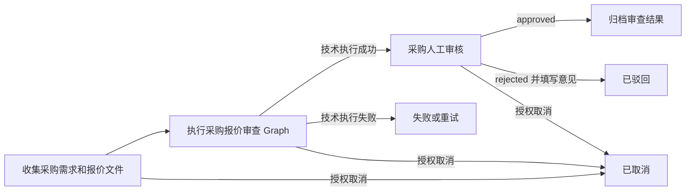

# 03 采购流程与状态机规范

> 文档状态：Deferred Scenario Specification
> 说明：业务 Workflow 语义有效；Agent 内部执行必须复用平台 Durable Run 状态机。

## 目的

定义 P0 采购报价审查流程，同时不在平台 Workflow Engine 中增加任何采购专用分支。

平台 Status 名称和状态转换行为继续以 `docs/03_PLATFORM_SPEC/WORKFLOW_STATE_MACHINE.md` 为准。采购业务结果是 Agent Output 中的结构化数据，不得新增为平台级 Status。

## 流程标识

| 项目 | 值 |
|---|---|
| Business App | `procurement` |
| Workflow Template Key | `procurement_quote_review` |
| Graph Key | `procurement_quote_review_graph` |
| Template Version | `1.0.0-draft` |
| Human Review | 始终必需 |

## P0 流程

Graph 可以把 `insufficient_information` 作为技术执行成功后的业务结果返回，使人工审核材料能够解释缺失信息。基础设施故障、配置无效或 Response Schema 无效属于技术失败。

## Node 定义

| Node | Type | 职责 | 成功条件 |
|---|---|---|---|
| `collect_materials` | `file_upload` | 收集采购需求和支撑文件 | 必填表单字段和最少文件元数据存在 |
| `analyze_quotes` | `agent_graph` | 执行提取、制度、比价、风险和报告流程 | Response 通过已发布 IO Contract 校验 |
| `human_review` | `human_review` | 记录承担责任的人类决策 | 授权审核人填写意见并批准或驳回 |
| `archive` | `system` | 保存已批准的最终审查材料 | Approval 后幂等归档成功 |

## 平台状态映射

| 流程时点 | Workflow Status | 当前 Node Status |
|---|---|---|
| 案例已创建 | `draft` | `collect_materials: pending` |
| 材料完成并启动 | `running` | `analyze_quotes: running` |
| Graph 结果已生成 | `waiting_review` | `human_review: waiting_review` |
| 人工批准 | `approved` | `human_review: succeeded` |
| 已批准结果归档 | `archived` | `archive: succeeded` |
| 人工驳回 | `rejected` | 按当前平台语义为 `human_review: failed` |
| 技术失败且无法继续 | `failed` | `analyze_quotes: failed` |
| 授权取消 | `cancelled` | 剩余活动 Node 变为 `cancelled` |

## 业务结果状态

Graph 在 `output.data.recommendation.status` 中返回以下值之一：

| 状态 | 含义 | 对人工审核的影响 |
|---|---|---|
| `recommended` | 领先方案在当前配置下通过 Mandatory Gate | 审核人仍拥有最终决策权 |
| `recommended_with_conditions` | 存在领先方案，但仍有重要条件未解决 | 授权人员必须解决或显式接受条件 |
| `not_recommended` | 没有方案满足已发布制度或评分阈值 | 审核人可以驳回，任何例外必须走批准流程 |
| `insufficient_information` | 信息缺失、歧义、过期或不可比较 | 要求补充信息，不能推断中标方案 |

这些业务结果绝不能自动把 Workflow 转换为 `approved` 或 `archived`。

## 启动前置条件

- 已认证用户拥有适用的 `workflow:create`、`file:upload`、`file:read` 和 `workflow:start` 权限；
- User 与 Workflow 属于同一 Tenant；
- `business_app_code` 为 `procurement`；
- Workflow Template、Graph、Domain Policy、Agent Version、Tool Permission、Policy Set 和 Scoring Profile 均已发布且处于 Active 状态；
- 采购需求包含品类、数量、目标币种和要求交付日期；
- P0 至少上传两份报价文件；
- 每个文件均通过 Type、Size、Malware 和 Tenant Ownership 检查；
- 使用 Idempotency Key 防止重复创建或重复启动案例。

如果制度要求三份报价，那么两份报价只能作为例外案例进行分析，在人工批准例外前必须保持不合规标记。

## Graph 完成条件

Graph Response 只有满足以下条件才算技术执行成功：

- 符合 `06_智能体输入输出契约.md`；
- 每份标准化报价都能关联到源文件；
- 每个重要发现至少包含一个 Evidence Reference 或 Calculation Reference；
- 包含 Policy Version 和 Scoring Version；
- 明确标记未知值和低置信度字段；
- 推荐措辞保持为建议性质；
- 没有尝试任何禁止的 Side Effect。

Graph 可以以 `insufficient_information` 完成业务处理；但当 IO Contract、Tenant Boundary、Configuration Integrity 或 Tool Authorization 无法保证时，必须执行失败。

## 人工审核规则

- P0 每个案例都必须进入 Human Review，不受分数高低影响。
- 申请人不得审批自己的案例。
- 批准和驳回都要求已认证 Actor，并填写非空 Decision Comment。
- Go 后端必须在决策时校验 Task Tenant 和 Assignee Role/User，前端是否显示按钮不构成权限边界。
- 审核人必须看到证据、制度版本、评分公式、置信度、假设、未解决问题和 Agent Run Error。
- Blocking Policy Violation 不能由 Agent 豁免。
- 如果企业允许制度例外，例外授权和证据必须作为外部已批准输入，并记录在 Decision Comment 或后续专门的 Exception Workflow 中。
- P0 只使用一个平台 `human_review` Node。金额、品类、法务或合规的多级审批属于后续 Template 能力，不得伪装成 Agent Graph 内部审批。

## 驳回和重新提交

当前平台的驳回路径会把 Workflow 结束为 `rejected`。P0 重新提交时创建新的 Workflow Instance，并在 Input Metadata 中引用原被驳回案例。新案例使用新的 `trace_id`，同时保留与旧案例的关联关系。

除非平台状态机增加经过批准、业务领域中立的重新提交转换，否则不得把被驳回 Workflow 直接退回前序 Node。

## 重试规则

| 失败类型 | 是否可重试 | 规则 |
|---|---|---|
| LLM、文件、制度或供应商服务临时超时 | 是 | 在 `max_retries` 内重试，保留 `trace_id`，生成新 `run_id` |
| Rate Limit 或暂时性上游失败 | 是 | 使用有上限的 Exponential Backoff |
| Policy 或 Scoring 配置无效 | 否 | 由授权 Owner 发布修正版 |
| 文件格式不支持或文件损坏 | 否 | 申请人重新提交受支持文件 |
| 商务数据缺失 | 不进行技术重试 | 返回 `insufficient_information` 交由人工处理 |
| Output Schema 校验失败 | 默认不自动重试 | Fail Closed，并检查 Contract/Model Version |
| Tool Permission 或 Domain Policy 违规 | 否 | 必须先修复安全或配置问题 |

所有重试必须幂等，不得重复创建文件、Approval Task、Archive 或外部 Side Effect。

## 取消规则

- 遵循平台对 `draft`、`running` 和 `waiting_review` Workflow 的取消规则。
- 取消需要权限和取消原因。
- 在 Client 支持时，应取消进行中的 Agent、Model 和 Tool 调用。
- 已取消案例不得创建 Approval 或 Archive。
- `archived` Workflow 不可修改。

## 状态不变量

1. 没有人工 Approval 记录，Workflow 不能进入 `archived`。
2. Agent 推荐不能设置 Workflow Approval Status。
3. 每次状态转换都保留 Tenant、`trace_id`、Workflow ID、Node ID、Actor、Timestamp 和 Configuration Version。
4. 执行失败或取消后不能留下 Active Approval Task。
5. 同一 Workflow 重试期间保持 Source File 和 Configuration Version 不变；配置改变时应创建新案例。
6. Archived Output 不可修改，修正必须创建关联的新版本或新 Workflow。
7. 采购业务结果不得变成平台 Workflow Engine 中的采购条件分支。

## 必需 Audit Event

- `procurement_review_created`；
- 每个文件对应的 `file_uploaded`；
- `workflow_started`；
- `agent_run_started`、`agent_run_completed` 或 `agent_run_failed`；
- Configuration Version 解析；
- 重要 Tool Authorization 失败；
- `approval_task_created`；
- `approval_approved` 或 `approval_rejected`；
- `workflow_retry`、`workflow_cancelled` 或 `workflow_archived`；
- Policy 或 Scoring Configuration 的发布与停用。

事件名称可以沿用平台现有命名规范，但 `detail_json` 必须包含 Procurement Case、Version 和 `trace_id`。
