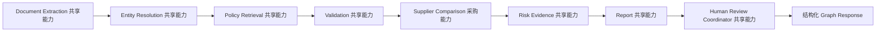

# 07 采购工作流与图编排规范

> 文档状态：Deferred Scenario Specification
> 更新日期：2026-08-16

## 目的

定义如何通过平台扩展点接入采购报价审查，同时不在 Go Workflow Engine 或 Agent Gateway 中加入采购专用逻辑。

## 注册资源

| Resource | Key | Domain | 初始状态 |
|---|---|---|---|
| Business App | `procurement` | `procurement` | P0 批准前保持 Draft |
| Workflow Template | `procurement_quote_review` | `procurement` | Draft |
| Agent Graph | `procurement_quote_review_graph` | `procurement` | Draft |
| Domain Policy | `procurement` | `procurement` 和 `shared` | Draft |

所有配置都必须经过平台的 Draft、Review、Publish 和 Deprecate Lifecycle，Configuration Author 不能批准自己的 Version。

## Workflow Template 定义

P0 Template 只使用现有的业务领域中立 Node Type 和 Edge Condition。

```json
{
  "business_app_code": "procurement",
  "workflow_template_key": "procurement_quote_review",
  "name": "采购报价审查",
  "version": "1.0.0",
  "graph_key": "procurement_quote_review_graph",
  "description": "标准化并比较供应商报价，整理审查证据，并强制进入人工审核。",
  "nodes": [
    {
      "id": "collect_materials",
      "type": "file_upload",
      "name": "收集采购需求和报价文件",
      "required": true
    },
    {
      "id": "analyze_quotes",
      "type": "agent_graph",
      "name": "分析供应商报价",
      "graph_key": "procurement_quote_review_graph",
      "input_mapping": {
        "procurement_case": "$input.procurement_case",
        "file_ids": "$files[*].id",
        "configuration_refs": "$input.configuration_refs"
      },
      "max_retries": 2
    },
    {
      "id": "human_review",
      "type": "human_review",
      "name": "采购审核人决策",
      "role": "business_reviewer",
      "required": true
    },
    {
      "id": "archive",
      "type": "system",
      "name": "归档采购审查结果",
      "action": "archive_result"
    }
  ],
  "edges": [
    {"from": "collect_materials", "to": "analyze_quotes", "when": "succeeded"},
    {"from": "analyze_quotes", "to": "human_review", "when": "succeeded"},
    {"from": "human_review", "to": "archive", "when": "approved"}
  ]
}
```

实现前必须确认当前 Template Input Mapping Evaluator 支持 `$input` 和 `$files[*]` 表达式。如果不支持，应增加业务领域中立的 Mapping 能力，或沿用平台已有 Input Shape；禁止为采购写特殊分支。

## Workflow 职责

Go 平台负责：

- Authentication、RBAC、Tenant 和 File Ownership；
- Workflow Template 解析与 Version Binding；
- Workflow 和 Node State Transition；
- Idempotency、Retry、Timeout、Cancellation 和 Dead Letter；
- Graph 与 Domain Policy 校验；
- Agent Run Log 和 Tool Run Log；
- Human Approval 创建及 Decision 持久化；
- 最终 Archive 和 Audit。

Python 服务负责：

- 执行由 `graph_key` 明确选择的 Procurement Graph；
- 编排共享能力；
- 执行采购领域的比价逻辑；
- 构造结构化 Response；
- 记录 Model Usage；
- 不直接修改权威平台状态。

## Graph 状态数据（Graph State）

Graph State 在概念上包含：

```text
trace_id
workflow_instance_id
node_instance_id
tenant_id
contract_version
procurement_case
file_ids
configuration_refs
extracted_documents
normalized_request
normalized_quotes
entity_matches
retrieved_policy
validation_result
comparison_result
risk_findings
report
review_packet
warnings
error
usage
```

State 必须有明确 Type 并通过 Schema Validation。Tenant 和 Trace Context 在整个 Run 中不可修改。

## Graph 流程



Human Review Coordinator 只准备审查 Metadata。后续 Workflow 的 `human_review` Node 才能触发 Go Approval Engine 创建正式 Task。

## Graph 节点（Graph Node）

| Node | Capability | Input | Output | Side Effect |
|---|---|---|---|---|
| `document_extraction` | Shared | 已授权 File Reference 和采购 Schema Profile | 提取字段、Confidence、Source Locator | 无 |
| `entity_resolution` | Shared | 提取的 Supplier Identity 和限定范围的 Supplier Source | Match Candidate 和 Confidence | 无 |
| `policy_retrieval` | Shared | Published Policy Reference 和 Category Context | Rule 和 Evidence Reference | 无 |
| `validation` | Shared | 提取/标准化 State 和 Rule Set | Data Quality、Comparability、Gate Result | 无 |
| `supplier_comparison` | Procurement | Comparable Quote 和 Scoring Profile | TCO、Scorecard 和 Ranking | 无 |
| `risk_evidence` | Shared | Validation、Comparison、Policy 和 Source Evidence | Structured Finding | 无 |
| `report` | Shared | 已校验结构化结果 | Review Report Data | 无 |
| `review_coordination` | Shared | Finding、Scorecard 和未解决问题 | Review Packet 和 Suggested Role | 无 |

## 共享与领域专用能力规则

- Shared Capability 实现通用 Contract，不得包含采购 Policy Constant。
- Procurement Graph 提供 Schema Profile、Rule Set、Tool Binding 和 Report Template。
- P0 中只有 `supplier_comparison` 计划作为采购专用 Reasoning Capability。
- TCO 算术和 Weighted Scoring 必须由确定性 Function 或 Tool 执行，不允许模型自由计算。
- 新业务领域应复用共享能力，只新增自己的 Graph 和 Domain Profile。

## 条件处理规则（Conditional Behavior）

Graph 内部 Condition 可以停止没有必要的处理，但不能批准 Workflow。

| 条件 | Graph 行为 |
|---|---|
| Authorization 或 Tenant 违规 | 立即失败 |
| Configuration 无效或未发布 | 立即失败 |
| 必需 Source 暂时不可用 | 返回 Retryable Error |
| File 不支持或损坏 | 返回包含 File ID 的 Non-Retryable Error |
| 商务事实缺失 | 在安全前提下继续生成 `insufficient_information` 审查材料 |
| Supplier Identity 歧义 | 不进入最终排名，并要求人工确认 |
| Supplier Restriction Blocker | 继续生成 Evidence/Report，但标记为 `not_recommended` |
| Output Schema 无效 | Fail Closed |

Graph 不得调用 Planner 来选择业务领域或 Graph。Routing 必须继续通过 `graph_key` 显式完成。

## Domain Policy 建议

```json
{
  "business_app_code": "procurement",
  "allowed_agent_domains": ["procurement", "shared"],
  "allowed_tool_domains": ["procurement", "shared"],
  "allow_shared_agents": true,
  "allow_shared_tools": true,
  "high_risk_requires_review": true,
  "status": "draft"
}
```

生产环境必须启用 Strict Policy。缺少 Procurement Domain Policy 时必须拒绝执行。

## Run 与 Node 关联

- 每次执行 `analyze_quotes` 创建 Durable Agent Run，并关联 Workflow Instance、Node Instance、Tenant 和 Trace。
- 每次 Retry 创建新的 Run Attempt 或新 Run，保留旧失败事实；不得覆盖历史 Run/Step。
- Graph Run 包含 Model、Capability、Tool、Checkpoint 和 Interrupt Step，并记录不可变配置版本。
- Agent Run Log 由 Durable Run 聚合生成，仅作为兼容摘要。
- Human Review 对应 Run Interrupt/Checkpoint；审批后通过幂等 Resume 继续。
- Capability Span 记录 Node Name、Capability/Profile/Skill Version，并作为 Run 的 Child Step。
- 恢复时先核对 ToolCall 和外部状态，不因 Retry 重复产生 Derived File 或其他副作用。

## Timeout 和 Retry 建议

| Stage | Timeout | Retry |
|---|---:|---:|
| File/Source Read | 每个 Source 30 秒 | Transient Failure 最多 2 次 |
| Model-Based Extraction/Explanation | 每次调用 90 秒 | Timeout/Rate Limit 最多 2 次 |
| Deterministic Validation/Scoring | 10 秒 | Input/Configuration 无效时不重试 |
| 整个 Graph | 5 分钟 | 由 Workflow Node Policy 控制 |

以上数值为 P0 建议，批准前必须进行 Load Test。同一 Workflow Run 的 Retry 不得改变 Policy、Scoring、Supplier 或 FX Version。

## 取消处理（Cancellation）

- Graph Execution 必须监听 Request Cancellation。
- Client 支持时，应取消待执行的 Model 和 Source Call。
- 已取消 Graph 返回平台兼容的 `cancelled` Status。
- Cancelled Result 不得创建 Report、Approval Task 或 Archive。

## 输出组装（Output Assembly）

只有经过校验的 State 才能传给 Report Agent。Report Agent 可以总结，但不能修改：

- Source Value；
- Data Quality State；
- Policy Result；
- Calculation Result；
- Score 或 Ranking；
- Finding Severity；
- Configuration Version；
- Human Review Requirement。

最终 Response 在返回 Go 前必须通过 `06_智能体输入输出契约.md` 校验。

## P0 测试

- Graph Registry 拒绝 Unknown 和 Cross-Domain Key。
- Domain Policy 只允许 `shared` 和 `procurement`。
- Shared Agent 不能访问 Finance 或其他 Domain Tool。
- Procurement Agent 不能在 Finance Graph 中运行。
- 商务事实缺失时 Graph 返回 `insufficient_information` Success Result。
- Configuration 或 Output Schema 无效时 Graph 失败。
- Retry 保持 Trace 和 Configuration Version 不变。
- Cancellation 阻止后续 Review 和 Archive。
- Report Output 不能引入无来源事实。
- 每个成功 Graph Result 都必须进入 Human Review。
